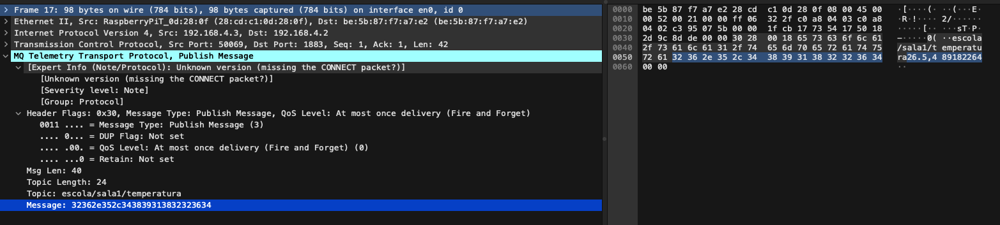
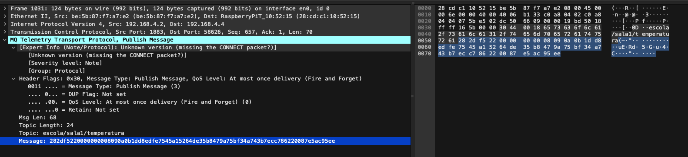

# Tarefa: IoT Security Lab - EmbarcaTech 2025

Autor: **Danilo Oliveira e Tífany Severo**

Curso: Residência Tecnológica em Sistemas Embarcados

Instituição: EmbarcaTech - HBr

Brasília, Maio de 2025

---

## 🎯 Objetivo do Projeto

Este projeto tem como foco o aprendizado prático de conceitos de segurança em sistemas embarcados com comunicação via MQTT utilizando a Raspberry Pi Pico W. São explorados mecanismos de criptografia, autenticação e comunicação assíncrona no modelo publish/subscribe.
São implementados dois programas principais:
- **main_publisher.c**: Publica mensagens em um tópico MQTT específico.
- **main_subscriber.c**: Assina um tópico MQTT e processa as mensagens recebidas.

## 🔧 Componentes Utilizados

- Raspberry Pi Pico W (RP2040)
- Display OLED SSD1306 (I2C)
- Botões físicos
- Joystick analógico
- Servidor MQTT (Mosquitto)

## 📌 Pinagem do Dispositivo

| Pino RP2040 | Função               | Conexão              |
|-------------|----------------------|-----------------------|
| GPIO 2      | Botão 1              | Entrada digital       |
| GPIO 3      | Botão 2              | Entrada digital       |
| GPIO 14     | SDA (I2C)            | Display OLED          |
| GPIO 15     | SCL (I2C)            | Display OLED          |
| GPIO 26     | ADC                  | Joystick              |


## ⚙️ Como Compilar e Executar

### Pré-requisitos

- Raspberry Pi Pico SDK configurado (`PICO_SDK_PATH`)
- CMake e GCC para ARM
- Visual Studio Code com extensões CMake Tools
- **Mosquitto (broker MQTT)** instalado
- Duas placas Raspberry Pi Pico W (uma para o publisher, outra para o subscriber).

### Configuração do Broker MQTT (Mosquitto)

Antes de executar os firmwares, é necessário configurar e iniciar o broker Mosquitto com autenticação por usuário e senha.

**Crie um arquivo de senhas:**

Se ainda não tiver um, crie um arquivo de senhas para o Mosquitto. Substitua `seu_usuario` pelo nome de usuário desejado (ex: `aluno` conforme `credentials.h`). Você será solicitado a digitar uma senha.

```bash
sudo mosquitto_passwd -c /etc/mosquitto/passwd seu_usuario
```
*Nota: O caminho `/etc/mosquitto/passwd` pode variar dependendo da sua instalação. Ajuste conforme necessário.*

**Configure o Mosquitto para usar o arquivo de senhas:**

Edite o arquivo de configuração do Mosquitto (geralmente `mosquitto.conf`, localizado em `/etc/mosquitto/mosquitto.conf` ou `/usr/local/etc/mosquitto/mosquitto.conf`). Adicione ou modifique as seguintes linhas:

```conf
# /etc/mosquitto/mosquitto.conf

# Permite conexões anônimas (false para exigir autenticação)
allow_anonymous false

# Caminho para o arquivo de senhas
password_file /etc/mosquitto/passwd 

# Listener padrão na porta 1883
listener 1883
protocol mqtt
```

**Inicie o Mosquitto:**

Inicie o serviço Mosquitto. Se já estiver rodando, reinicie-o para aplicar as novas configurações.

Verifique o endereço IP da máquina onde o Mosquitto está rodando. Você precisará dele para configurar os firmwares.

### Configuração dos Firmwares (Publisher e Subscriber)

Antes de compilar, você precisa ajustar as credenciais e configurações de rede no arquivo `config/credentials.h`:

**Configure as Credenciais Wi-Fi:**

Modifique as macros `WIFI_SSID` e `WIFI_PASSWORD` com os dados da sua rede Wi-Fi:

```c
// filepath: config/credentials.h
// ...
#define WIFI_SSID "SUA_REDE_WIFI"
#define WIFI_PASSWORD "SUA_SENHA_WIFI"
// ...
```

**Configure o Endereço IP do Broker MQTT:**

Altere a macro `MQTT_BROKER_IP` para o endereço IP da máquina onde o Mosquitto está rodando:

```c
// filepath: config/credentials.h
// ...
#define MQTT_BROKER_IP "IP_DO_SEU_BROKER_MOSQUITTO" // Ex: "192.168.1.10"
// ...
```

**Verifique as Credenciais MQTT:**

Certifique-se de que `MQTT_USER` e `MQTT_PASS` em `config/credentials.h` correspondem ao usuário e senha que você configurou no Mosquitto:

```c
// filepath: config/credentials.h
// ...
#define MQTT_USER "aluno" // Deve ser o mesmo usuário do mosquitto_passwd
#define MQTT_PASS "senha123" // Deve ser a mesma senha do mosquitto_passwd
// ...
```
*As chaves `XOR_KEY`, `HMAC_SECRET_KEY`, e `AES_KEY` devem ser as mesmas para que a comunicação segura funcione entre publisher e subscriber.*

### Compilação

```bash
git clone https://github.com/seu_usuario/seu_repositorio.git
cd tarefa-iot-security-lab-guia_do_mochileiro
export PICO_SDK_PATH=/caminho/para/o/pico-sdk
mkdir build
cd build
cmake ..
make
```

Após a compilação bem-sucedida, você encontrará os arquivos de firmware `.uf2` dentro do diretório `build/`. Os principais serão:
- `main_publisher.uf2`
- `main_subscriber.uf2`

### Execução

Você precisará de duas placas Raspberry Pi Pico W.

**Para o Publisher:**
1.  Conecte uma placa Pico W ao seu computador enquanto mantém o botão `BOOTSEL` pressionado.
2.  A placa será montada como um dispositivo de armazenamento em massa (como um pendrive).
3.  Arraste e solte o arquivo `main_publisher.uf2` (do seu diretório `build/`) para dentro desse dispositivo de armazenamento.
4.  A placa irá reiniciar automaticamente e começar a executar o firmware do publisher.

**Para o Subscriber:**
1.  Conecte a segunda placa Pico W ao seu computador enquanto mantém o botão `BOOTSEL` pressionado.
2.  A placa será montada como um dispositivo de armazenamento em massa.
3.  Arraste e solte o arquivo `main_subscriber.uf2` (do seu diretório `build/`) para dentro desse dispositivo de armazenamento.
4.  A placa irá reiniciar automaticamente e começar a executar o firmware do subscriber.

**Monitoramento:**

Você pode usar um terminal serial (como `minicom` no Linux/macOS ou PuTTY no Windows) para visualizar as mensagens de `printf` de cada Pico e acompanhar o status da conexão Wi-Fi, MQTT e as mensagens enviadas/recebidas.

Com ambos os firmwares rodando e o broker Mosquitto ativo e configurado corretamente, o publisher começará a enviar mensagens, e o subscriber deverá recebê-las, processá-las de acordo com o modo de segurança selecionado no menu de cada dispositivo e exibir as informações no display OLED.


## 📸 Demonstração do funcionamento

### Sem Segurança


*Publisher envia dados em plaintext. Subscriber recebe e exibe os dados como chegam, incluindo o timestamp para prevenção de replay.*

### Encriptação XOR


*Publisher aplica uma cifra XOR na mensagem antes de enviar. Subscriber aplica a mesma cifra XOR para descriptografar e exibir a mensagem original.*

### Autenticação HMAC


*Publisher calcula um HMAC-SHA256 da mensagem e o envia junto. Subscriber recalcula o HMAC e o compara para verificar a autenticidade e integridade da mensagem.*

### AES-GCM


*Publisher criptografa a mensagem e gera uma tag de autenticação usando AES-GCM. Subscriber descriptografa e verifica a tag para garantir confidencialidade e autenticidade.*


## 🔐 Segurança Implementada
- XOR Simples – Método didático de criptografia simétrica
- Timestamp – Validação temporal para evitar ataques de replay
- AES-GCM – Criptografia simétrica robusta com autenticação integrada
- HMAC-SHA256 – Autenticação de mensagens com chave secreta


## 📊 Resultados Esperados/Observados

- O sistema executou conforme o esperado. Foram realizados testes com múltiplos esquemas de criptografia, verificando:
- Integridade e confidencialidade de mensagens trocadas via MQTT.
- AES-GCM apresentou melhor desempenho em segurança e integridade.
- Sistema de publisher/subscriber implementado com sucesso via MQTT.
- A comunicação entre os dispositivos foi segura e eficiente, reforçando o aprendizado do modelo MQTT e das técnicas de segurança implementadas.

### Testes no Wireshark

**Pacote MQTT no Modo Sem Segurança:**



*Captura do Wireshark mostrando um pacote MQTT publicado no modo "Sem Segurança". O payload (em hexadecimal: `32362e352c343839313832323634`) é visível, correspondendo à mensagem "26.5,489182264" (dado e timestamp).*

**Pacote MQTT Criptografado com AES-GCM:**



*Captura do Wireshark mostrando um pacote MQTT publicado no modo "AES-GCM". O payload está criptografado, tornando o conteúdo original (dado e timestamp) ilegível na transmissão.*

# 🧠 Técnicas Escaláveis em MQTT para Ambientes com Múltiplas BitDogLab

- Quais técnicas são escaláveis?
- Como aplicá-las com várias BitDogLab em rede escolar?

---

## ✅ Quais técnicas são escaláveis?

As seguintes técnicas foram avaliadas como **altamente escaláveis** ou **adequadas para ambientes com múltiplos dispositivos**:

- **Protocolo MQTT**: Leve e altamente escalável, ideal para redes com muitos dispositivos IoT.
- **Autenticação MQTT com usuário/senha**: Escalável até certo ponto, pode exigir gerenciamento centralizado.
- **Timestamps**: Altamente escaláveis, essenciais para prevenir ataques de repetição e ordenar eventos.
- **HMAC (Hash-based Message Authentication Code)**: Escalável para autenticação de mensagens.
- **Criptografia AES-GCM**: Escalável para proteção do payload com autenticação integrada.
- **OTA (Over-The-Air updates)**: Permite atualização remota de firmware, essencial para manutenção em larga escala.
- **Sincronização com NTP/RTC**: Escalável para manter a precisão de tempo mesmo sem internet.
- **Monitoramento do Broker**: Escalável para diagnóstico centralizado e controle da rede MQTT.

> ⚠️ A criptografia **XOR** foi considerada **não segura** e **não recomendada**, mesmo que seja leve.

---

## 🏫 Como aplicar em uma rede escolar com várias BitDogLab?

Para garantir segurança, escalabilidade e manutenção eficiente de múltiplas BitDogLab em uma rede escolar, recomenda-se a seguinte arquitetura e práticas:

1. **Broker Dedicado**
   - Utilize um broker MQTT exclusivo para a rede da escola (ex.: Mosquitto).
   - Permite controle total sobre tópicos, autenticação e segurança.

2. **Comunicação Segura com TLS**
   - Habilite **TLS** para criptografar a comunicação MQTT entre os dispositivos e o servidor.
   - Garante confidencialidade e integridade dos dados.

3. **Autenticação Forte**
   - Configure autenticação via usuário/senha ou com **certificados digitais**/**HMAC**.
   - Reduz o risco de acesso indevido.

4. **ACLs (Listas de Controle de Acesso)**
   - Defina regras para limitar o acesso de cada BitDogLab aos tópicos MQTT.
   - Melhora a segurança e evita interferência entre dispositivos.

5. **Criptografia de Payload com AES-GCM**
   - Proteja as mensagens com **AES-GCM**, garantindo confidencialidade e autenticação.

6. **Uso de Timestamps**
   - Adicione timestamps às mensagens para garantir validade temporal e evitar replay attacks.
   - Compatível com HMAC e AES-GCM.

7. **OTA (Over-The-Air Updates)**
   - Implemente atualizações remotas de firmware para facilitar manutenção contínua.

8. **Sincronização de Tempo (NTP/RTC)**
   - Utilize **NTP** para dispositivos com internet ou **RTC** para os que operam offline.

9. **Monitoramento do Broker**
   - Configure logs e métricas do broker (ex.: conexões, tópicos, falhas).
   - Ajuda na detecção de falhas e comportamentos suspeitos.

---

Com essa abordagem, a rede escolar poderá operar com **segurança**, **eficiência** e **escalabilidade**, mesmo com dezenas ou centenas de dispositivos BitDogLab conectados simultaneamente.


---

## 📜 Licença
GNU GPL-3.0.
